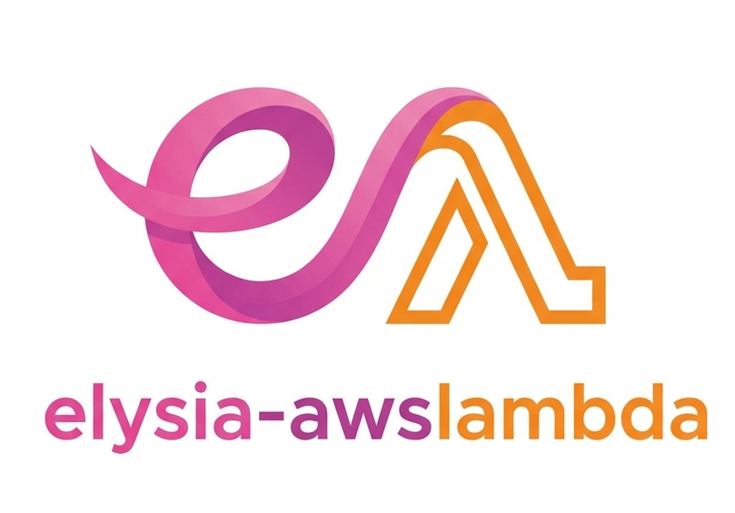

<p align="center">
  
</p>

# elysia-awslambda

Use Elysia in AWS Lambda functions with API Gateway v2.

## Features

- Convert API Gateway v2 events to Web Request
- Convert Elysia responses to API Gateway v2 format
- Full support for query strings, path parameters, and headers
- Automatic base64 encoding for binary responses
- TypeScript support

## Installation

```bash
npm install elysia-awslambda
```

or using yarn

```bash
yarn add elysia-awslambda
```

or using pnpm

```bash
pnpm add elysia-awslambda
```

or using bun

```bash
bun add elysia-awslambda
```

## Usage

### Basic Example

```typescript
import { Elysia } from 'elysia'
import { handle } from 'elysia-awslambda'

const app = new Elysia()

app.get('/', (c) => {
  return c.status(200, { message: 'Hello, world!' })
})

export default handle(app)
```

### With Path Parameters

```typescript
import { Elysia, Context } from 'elysia'
import { handle } from 'elysia-awslambda'

const app = new Elysia()

app.get('/:token', (c: Context) => {
  if (!c.params.token) {
    return c.status(400, { message: 'Token is required' })
  }

  return c.status(200, {
    message: 'Token found',
    token: c.params.token,
  })
})

export default handle(app)
```

### With Error Handling

```typescript
import { Elysia } from 'elysia'
import { handle } from 'elysia-awslambda'

const app = new Elysia()

app.onError(({ error, code }) => {
  return {
    message: 'Something went wrong!',
    error,
  }
})

app.get('/', () => {
  throw new Error('Intentional error')
})

export default handle(app)
```

## Serverless Framework Integration

The library works seamlessly with [serverless-bun-plugin](https://github.com/thadeu/serverless-bun-plugin) for deploying Elysia apps to AWS Lambda.

### Project Structure

```
project/
├── accounts/
│   ├── handler.ts
│   └── router.ts
├── package.json
├── serverless.yml
└── tsconfig.json
```

### serverless.yml

```yaml
frameworkVersion: '>= 3 < 4'
service: elysia-awslambda

provider:
  name: aws
  architecture: arm64
  stage: staging
  region: us-east-1

custom:
  bun:
    version: 1.3.4

package:
  individually: true
  patterns:
    - '!node_modules/**'

functions:
  accounts:
    handler: accounts/handler.default
    runtime: bun:1.x
    memorySize: 256
    timeout: 30
    architecture: arm64
    url: true

plugins:
  - serverless-bun-plugin
```

### accounts/router.ts

```typescript
import { Elysia, Context } from 'elysia'
import { handle } from 'elysia-awslambda'

export const app = new Elysia()

app.get('/', async (c: Context) => {
  return c.status(200, { message: 'Hello, world!' })
})

app.get('/:token', async (c: Context) => {
  if (!c.params.token) {
    return c.status(400, { message: 'Token is required' })
  }

  return c.status(200, { message: 'Token found', token: c.params.token })
})

app.onError(({ error, code }) => {
  return {
    message: 'Something went wrong!',
    error,
  }
})

export default handle(app)
```

### accounts/handler.ts

```typescript
import Router from '@/accounts/router'

export default async function main(event: any, context: any) {
  const response = await Router(event, context)

  return response
}
```

### tsconfig.json

```json
{
  "compilerOptions": {
    "target": "ES2022",
    "module": "ESNext",
    "moduleResolution": "bundler",
    "lib": ["ES2022"],
    "types": ["bun-types"],
    "strict": true,
    "esModuleInterop": true,
    "skipLibCheck": true,
    "forceConsistentCasingInFileNames": true,
    "paths": {
      "@/*": ["./*"]
    }
  }
}
```

## How It Works

The `handle` function wraps your Elysia app and provides the necessary transformation layer between AWS Lambda and Elysia:

1. **Request Transformation**: Converts API Gateway v2 events to standard Web Request objects

   - Extracts HTTP method, path, query strings, and headers
   - Handles base64 encoded request bodies
   - Constructs proper URL with protocol and host

2. **Response Transformation**: Converts Elysia Response objects to API Gateway v2 format

   - Extracts status code and headers
   - Handles text and binary responses
   - Automatically encodes binary data as base64

3. **Native Elysia Support**: Use all Elysia features
   - Path parameters and query strings
   - Middleware and plugins
   - Error handling
   - Type safety with TypeScript

## API

### handle(app: Elysia)

Wraps an Elysia app and returns an AWS Lambda handler function.

**Parameters:**

- `app`: An Elysia app instance

**Returns:**

- AWS Lambda handler function with signature `(event: APIGatewayProxyEventV2, context: Context) => Promise<APIGatewayProxyResultV2>`

## Requirements

- Bun runtime
- Elysia v1.4+
- AWS Lambda with API Gateway v2

## Example Project

See the [example](./example/elysia-awslmabda-fn) directory for a complete working implementation.

## License

MIT License

Copyright (c) 2025 Thadeu

Permission is hereby granted, free of charge, to any person obtaining a copy
of this software and associated documentation files (the "Software"), to deal
in the Software without restriction, including without limitation the rights
to use, copy, modify, merge, publish, distribute, sublicense, and/or sell
copies of the Software, and to permit persons to whom the Software is
furnished to do so, subject to the following conditions:

The above copyright notice and this permission notice shall be included in all
copies or substantial portions of the Software.

THE SOFTWARE IS PROVIDED "AS IS", WITHOUT WARRANTY OF ANY KIND, EXPRESS OR
IMPLIED, INCLUDING BUT NOT LIMITED TO THE WARRANTIES OF MERCHANTABILITY,
FITNESS FOR A PARTICULAR PURPOSE AND NONINFRINGEMENT. IN NO EVENT SHALL THE
AUTHORS OR COPYRIGHT HOLDERS BE LIABLE FOR ANY CLAIM, DAMAGES OR OTHER
LIABILITY, WHETHER IN AN ACTION OF CONTRACT, TORT OR OTHERWISE, ARISING FROM,
OUT OF OR IN CONNECTION WITH THE SOFTWARE OR THE USE OR OTHER DEALINGS IN THE
SOFTWARE.
